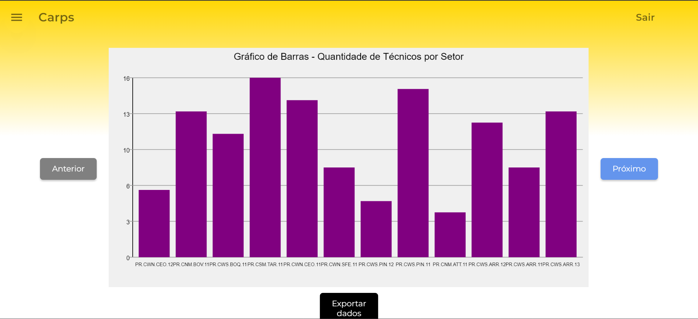

# Carps

Projeto desenvolvido no módulo 6 enquanto estava no curso de Ciência da Computação

## Descrição
Este projeto foi desenvolvido em parceira com a V.tal e ele consiste em um algoritmo de otimização para a alocação dos técnicos da V.tal para os chamados abertos, visando um menor tempo de resposta e transporte.

## Mídia

### Tela do website

    

        
        
        
        
    

## Repositório

    Clique [aqui](https://github.com/InteliProjects/2023M6T5Inteli-g1-consilium/tree/main) para o repositório no GitHub!

