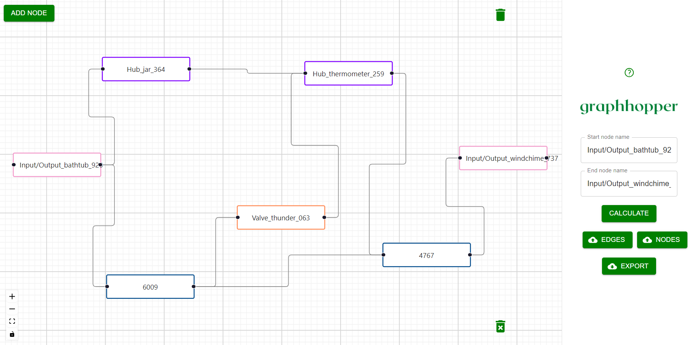
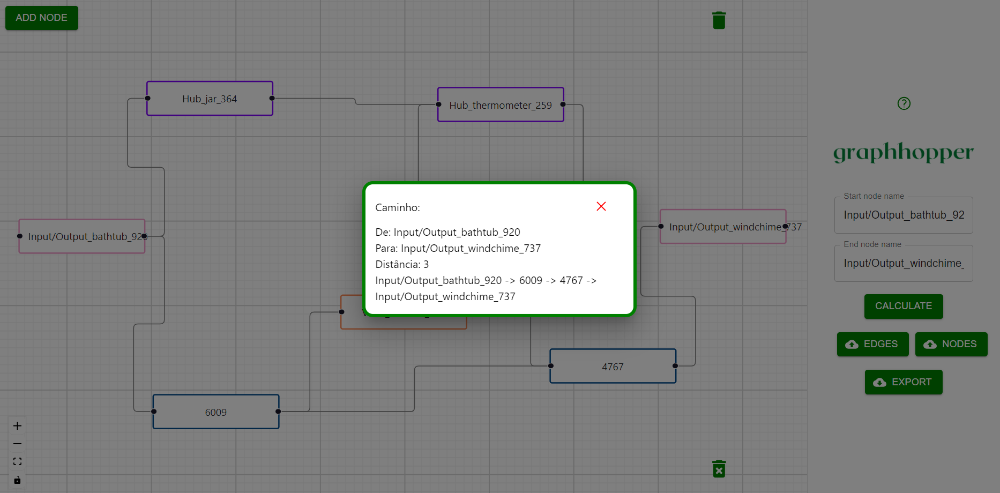

# Roots

Projeto desenvolvido no módulo 5 enquanto estava no curso de Ciência da Computação

## Descrição
Este projeto foi desenvolvido em parceira com a Rockwell Automation, Inc. e ele consiste em uma ferramenta de prototipação de conexões entre válvulas e tanques para uma cervejaria a qual a Rockwell estava produzindo de automação, sendo que a ferramenta mostra o menor caminho entre dois elementos distintos.

## Mídia

### Tela do website

    

        
        
    

## Repositório

    Clique [aqui](https://github.com/InteliProjects/2023M5T5-Inteli-grupo4) para o repositório no GitHub!

