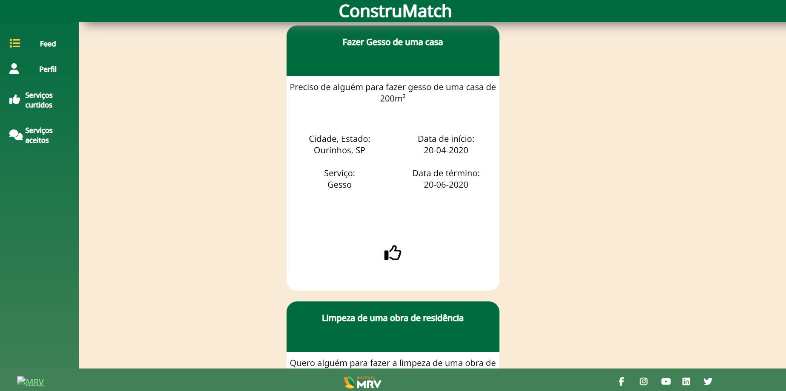

# ConstruMatch

Projeto desenvolvido no módulo 2

## Descrição
Este projeto foi desenvolvido em parceira com a MRV Engenharia e Participações S/A e ele consiste em um site que ajude na conexão entrea MRV e empreiteiros locais para facilitar a contratação das diversas áreas terceirizadas no processo de contrução.

## Mídia

### Tela do website

    

        
    

## Repositório

    Clique [aqui](https://github.com/2022M2T6-Inteli/Projeto1/tree/main) para o repositório no GitHub!

