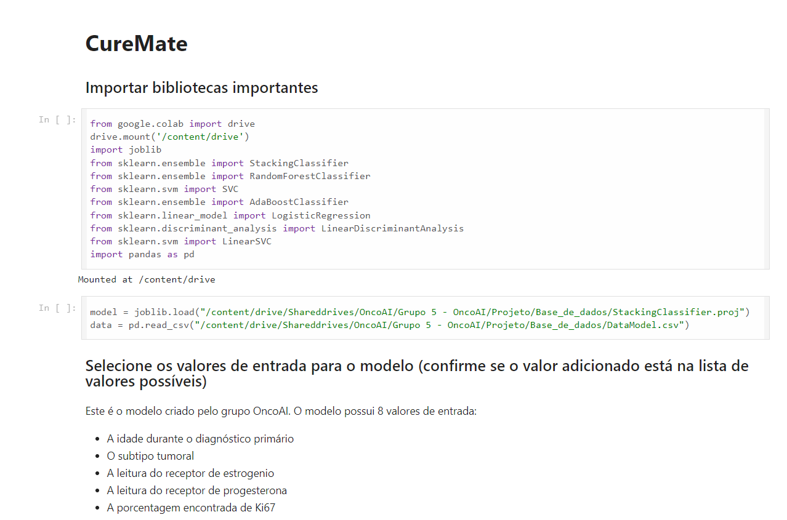
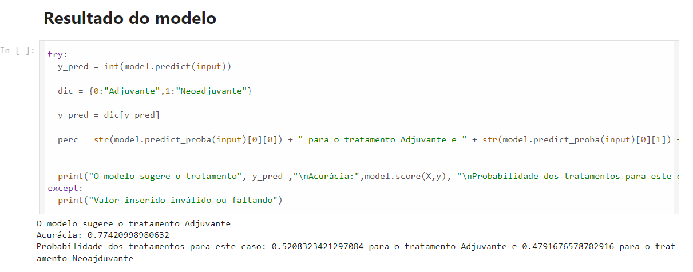

# CureMate

Projeto desenvolvido no módulo 3

## Descrição
Este projeto foi desenvolvido em parceira com a Faculdade de Medicina da USP e ele consiste em um modelo preditivo que auxilia na escolha do melhor tipo de tratamento para pacientes de câncer de mama, em específico, na escolha entre tratamento adjuvante e neoajduvante.

## Mídia

### Screenshots do notebook

    

        
    

    

        
    

## Repositório

    Clique [aqui](https://github.com/2023M3T5-Inteli/grupo5/tree/main) para o repositório no GitHub!

