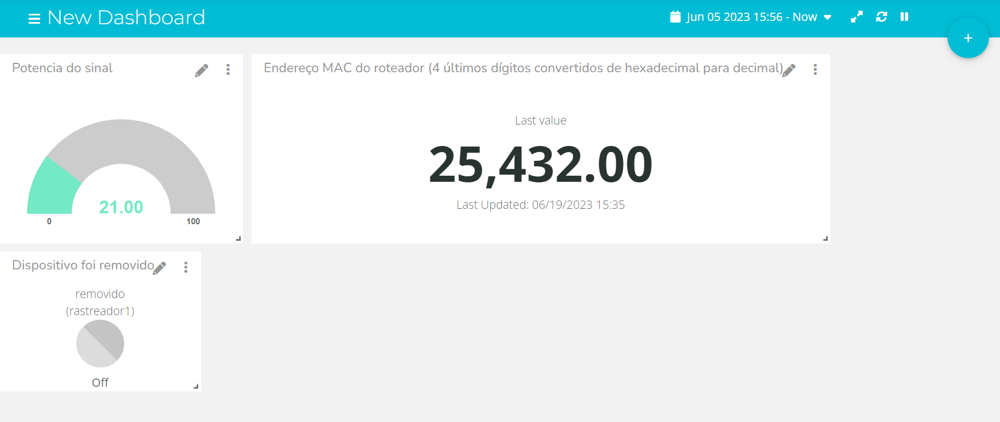

# P Tag

Projeto desenvolvido no módulo 4

## Descrição
Este projeto foi desenvolvido em parceira com a Pirelli & C. S.p.A e ele consiste um sistema rastreador acoplável para diminuir o caso de perdas de notebooks e tablets na fábrica da empresa.

## Mídia

### Tela do dashboard

    

        
    

### Fotos do protótipo físico

    

        

            
            
        

    

## Repositório

    Clique [aqui](https://github.com/2023M4T5-inteli/projeto6) para o repositório no GitHub!

